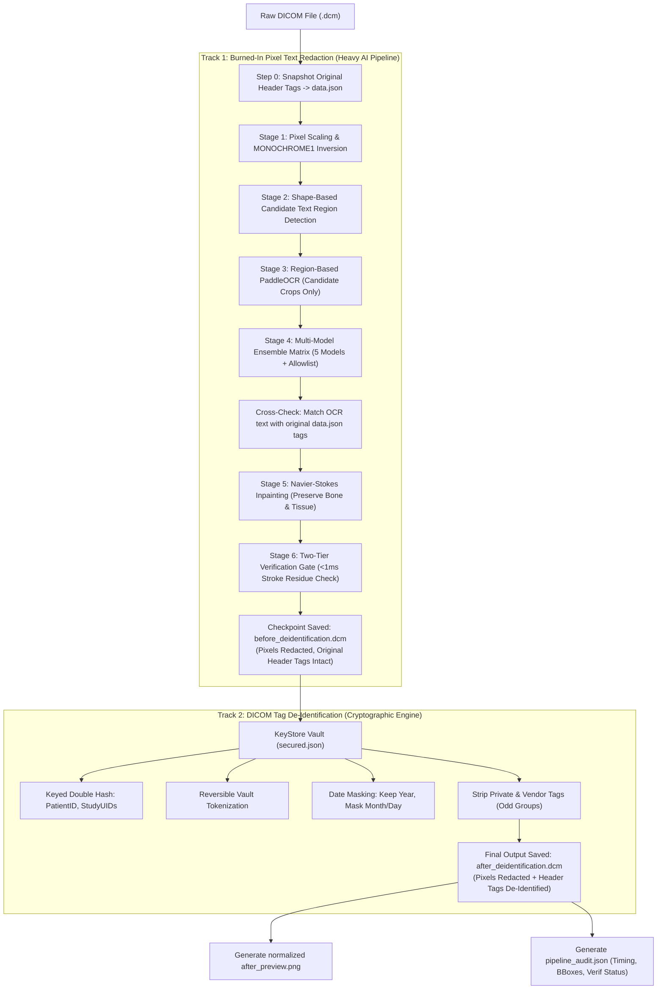
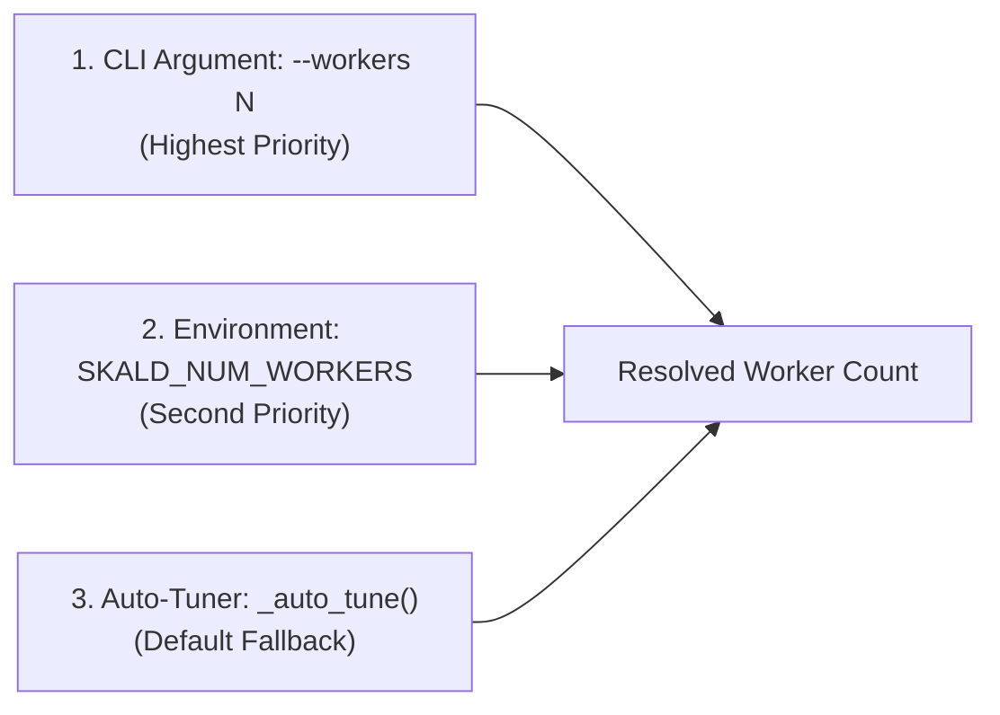
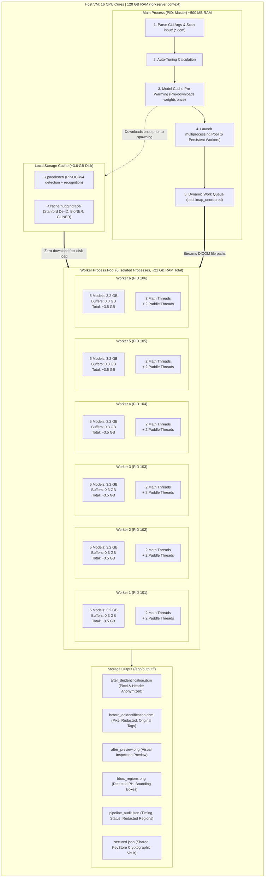
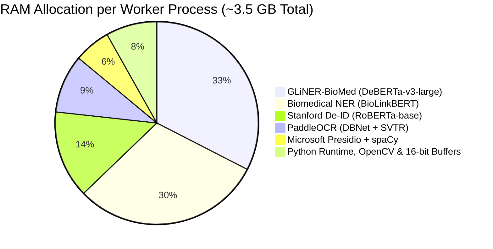
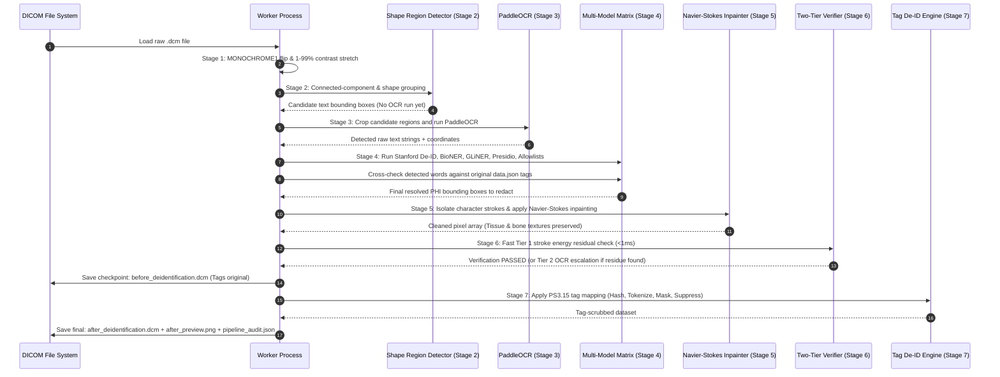

# Parallel DICOM De-Identification Architecture & Memory Specification

---

## 1. High-Level System Overview & Dual-Track Workflow

The **DICOM De-Identification Pipeline** operates as two distinct, synchronized tracks that execute in a single unified pass per file:
1. **Track 1: Burned-in Pixel Text Redaction** — Deep learning vision and NLP stack (PaddleOCR, Stanford De-ID, Biomedical NER, GLiNER-BioMed, Microsoft Presidio, and Navier-Stokes Inpainting).
2. **Track 2: DICOM Tag Metadata De-Identification** — Cryptographic tag engine applying keyed double hashing, tokenization vaults, date masking, and private tag stripping per DICOM PS3.15 Annex E.



---

## 2. Accurately Resolved Worker Allocation

The pipeline dynamically determines active parallel workers using a 3-tier resolution hierarchy in `app/main_parallel.py`:



### Auto-Tuner Formula
```python
threads = 2                  # PyTorch / OpenMP / MKL thread cap
paddle_internal_threads = 2  # Internal threads spawned by Paddle runtime
effective_per_worker = 4     # Effective threads per worker
ram_per_worker_gb = 3.5      # ~3.2 GB model weights + 0.3 GB image buffers

max_by_cpu = max(1, int(TOTAL_CPUS * 1.25 / effective_per_worker))
max_by_ram = max(1, int((available_gb - 8) / ram_per_worker_gb))

workers = max(2, min(max_by_cpu, max_by_ram, 10))
```

### Worker & Thread Allocation Across Environments

| Environment | CPU Cores | Available RAM | Active Workers | Effective Threads | Total RAM Used | Operational Mode |
| :--- | :---: | :---: | :---: | :---: | :---: | :--- |
| **Production Multi-Core VM** *(Commit 975daef)* | **16 Cores** | **125 GB** | **6 Workers** | 24 threads | **~21.0 GB** | High-throughput VM batching; 90–95% CPU saturation |
| **Current Local Machine** | **16 Cores** | **~2.1 GB free** | **2 Workers** | 8 threads | **~7.0 GB** | Safe floor clamped by auto-tuner to prevent OOM |
| **Custom User Override** | Any | Any | **N Workers** | $N \times 4$ | $N \times 3.5$ GB | Invoked with `--workers <N>` |

---

## 3. Parallel Processing VM Architecture



---

## 4. RAM (Memory) Distribution per Worker Process



### Exact Memory Footprint Breakdown

| Engine / Component | Architecture / Weights | Disk Cache Size | Resident RAM (per Worker) | Primary Role |
| :--- | :--- | :---: | :---: | :--- |
| **GLiNER-BioMed** | `urchade/gliner_large-v2.1` | ~1.7 GB | **~1,400 MB** | Zero-shot detection of 30+ radiology anatomy & technique labels |
| **Biomedical NER** | `d4data/biomedical-ner-all` | ~1.4 GB | **~1,300 MB** | Clinical entity recognition (diseases, symptoms, organs) |
| **Stanford De-ID** | `StanfordAIMI/stanford-deidentifier-base` | ~500 MB | **~600 MB** | Radiology-specific PHI identification (Patient, MRN, Hospital) |
| **PaddleOCR** | PP-OCRv4 (`det` + `rec`) | ~45 MB | **~400 MB** | Cropped text detection and character reading |
| **Microsoft Presidio** | Rule Analyzer + `en_core_web_sm` | ~15 MB | **~250 MB** | Structured PII patterns (DOB, dates, phone numbers, locations) |
| **Pixel Buffers & OpenCV** | 16-bit DICOM arrays (up to 3000×3000) | — | **~350 MB** | Image scaling, LUT mappings, inpainting scratch arrays |
| **Total per Worker** | — | **~3.6 GB** | **~3.5 GB to 3.8 GB** | **Isolated RAM per child process** |

---

## 5. Detailed 7-Stage Pipeline Lifecycle



---

## 6. Latency Profile & Stage Bottlenecks

| Stage | Name | Average Latency | % of Total Time | Bottleneck Type | Optimization Implemented |
| :---: | :--- | :---: | :---: | :--- | :--- |
| **1** | Ingestion & Dynamic Scaling | ~0.08s | 2% | Disk I/O & NumPy percentiles | Vectorized contrast stretching |
| **2** | Text Region Detection | ~0.05s | 1% | Morphological filtering | Shape-only candidate filtering (no OCR) |
| **3** | Region-Based PaddleOCR | ~0.60s – 1.10s | **25%** | Deep learning inference | **Runs on cropped regions only** (avoids full image) |
| **4** | Multi-Model Classification Matrix | ~1.20s – 2.00s | **50%** | 3 Transformers + Presidio sequential pass | Clinical allowlist bypass; block expansion |
| **5** | Navier-Stokes Inpainting | ~0.25s – 0.45s | **12%** | PDE boundary value iterations | Character stroke isolation (only letters inpainted) |
| **6** | Verification Gate | ~0.01s – 0.05s | 2% | Re-verification | **Tier 1 stroke residual gate (<1ms)** |
| **7** | Tag De-Identification & Save | ~0.15s – 0.25s | 8% | Cryptographic hashing & file writes | Reused in-memory KeyStore |
| **All** | **Total per File (Single Worker)** | **~2.3s – 4.0s** | **100%** | — | **Throughput across 6 Workers: ~0.4s to 0.7s / file** |
