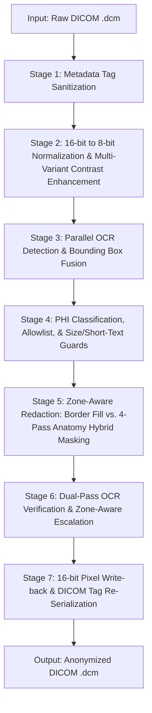

# Unified Hybrid DICOM Pixel Anonymization Pipeline
## Detailed End-to-End Technical Documentation (Input to Output)

This document provides a comprehensive, step-by-step description of the **Unified Hybrid DICOM Pixel Anonymization Pipeline** implemented in `dicom_anonymizer_pipeline.py`. The pipeline processes 8-bit and 16-bit DICOM Computed Radiography (CR), Digital Radiography (DX), and general X-ray images, removing burned-in patient/institutional metadata (PHI) from both flat margins and complex anatomical fields, outputting **only valid DICOM files** with preserved dynamic range and diagnostic fidelity.

---

## 📐 Pipeline Architecture Overview

The system operates as a **7-Stage Sequential Processing Pipeline**:



---

## 🔍 Detailed Step-by-Step Stages

### 📋 Stage 1: Metadata Tag Sanitization
* **Purpose:** Removes all textual PII/PHI stored in the header tags before touching the image pixels.
* **Process:**
  1. Identifies and clears **30+ default DICOM de-identification profile tags** (such as `PatientName`, `PatientID`, `PatientBirthDate`, `ReferringPhysicianName`, `AccessionNumber`, `InstitutionName`, `StationName`, `StudyDate`, `StudyTime`, etc.).
  2. Sets `PatientName` and `PatientID` to empty strings (`""`) to prevent default overlays in DICOM viewers.
  3. Re-generates all Study, Series, and SOP Instance UIDs to break linkability.
  4. Purges all vendor-specific private tags (any tag with an odd group number).

### 🌓 Stage 2: Normalization & Multi-Variant Enhancement
* **Purpose:** Prepares high-dynamic range pixel arrays for optimal text character extraction by OCR engines.
* **Process:**
  1. Detects photometric inversion (`MONOCHROME1` vs `MONOCHROME2`). If `MONOCHROME1` (where white pixels are dark) is detected, values are flipped temporarily to ensure text strokes appear bright on a dark background for OCR accuracy.
  2. Normalizes 16-bit data (`0 to 65535` or `0 to 4095` for 12-bit) down to standard 8-bit grayscale space (`0 to 255`).
  3. Generates **5 enhanced variants** to maximize text readability:
     * **Standard:** Original normalized image.
     * **CLAHE:** Contrast Limited Adaptive Histogram Equalization to pop text in low-contrast borders.
     * **Adaptive Threshold:** Binarization to isolate high-contrast characters.
     * **Inverse Threshold:** Inverts luminance to capture dark text on bright bounds.
     * **Sharpening:** Applies a 3x3 Gaussian unsharp mask to clarify blurred/scanned text characters.

### 🤖 Stage 3: Parallel OCR Detection & Fusion
* **Purpose:** Detects character strings and coordinates on all 5 image variants.
* **Process:**
  1. Runs **PaddleOCR** and **EasyOCR** engines in parallel across all 5 variants.
  2. Groups overlapping bounding boxes using an **Intersection-over-Union (IoU) threshold of 0.3**.
  3. Merges overlapping coordinates into a single bounding box enclosing the entire word or phrase.
  4. Fuses confidence scores, selecting the text variant with the highest confidence or longest string length.

### 🛡️ Stage 4: PHI Classification & Robustness Guards
* **Purpose:** Filters out clinical metadata, ignores OCR artifacts, and classifies remaining text as PHI.
* **Process:**
  1. **Clinical Allowlist Filter:** Matches text against safe directional/radiographic terms (e.g. `L`, `R`, `PA`, `AP`, `LAT`, `CHEST`, `PORTABLE`, `CM`, `KVP`, `MAS`). Matches are **preserved** (not redacted).
  2. **Size Validation Guard (OCR Artifact Filter):** If a bounding box spans more than 15% of image height, 85% of image width, or 10% of total image area (e.g., `[0, 0, 1024, 1024]`), it is classified as a page-border or layout artifact and discarded.
  3. **Short-Text Validation Guard:** Discards any text block in the anatomy region shorter than 3 characters (e.g. `''`, `'1'`, `'A'`) unless flagged by NLP or Regex.
  4. **Zone Classification:** Classifies remaining text blocks spatially:
     * **Border Zone:** Middle of box lies in the outer margins (top/bottom 18%, left/right 10%).
     * **Anatomy Zone:** Box overlaps the central clinical regions (lung/rib parenchyma).

### 🖋️ Stage 5: Zone-Aware Redaction (Multi-Hybrid Masking)
* **Purpose:** Redacts text without destroying underlying anatomy or leaving solid block voids in diagnostic fields.
* **Process:**
  * **Border Zone Strategy:** Fills the bounding box with the local median background intensity. This matches the surrounding film tone seamlessly.
  * **Anatomy Zone (4-Pass Structure-Preserving Masking):**
    1. **Pass 1 (Ink Stroke Isolation):** Applies Otsu + Adaptive thresholding on the local ROI to extract only the text character strokes. Creates a precise binary mask of the ink, leaving the surrounding lung/bone pixels untouched.
    2. **Pass 2 (Navier-Stokes Inpainting):** Uses a structure-aware Navier-Stokes algorithm (radius=9) to propagate anatomical gradients and textures inward along the thin ink lines, restoring the bones/lungs underneath the letters.
    3. **Pass 3 (Telea Inpainting):** Runs a Fast Marching method (radius=5) on remaining ink pixels to erase outline edges and thin serifs.
    4. **Pass 4 (Bilateral Blend):** Applies an edge-preserving bilateral filter only to the masked pixels to smooth out high-frequency noise and match the local anatomical texture.

### 🧪 Stage 6: Dual-Pass Verification & Escalation
* **Purpose:** Ensures zero text remains in the output DICOM.
* **Process:**
  1. Re-normalizes the redacted image to 8-bit and runs the Stage 3 OCR check again.
  2. If no text is detected, the status is set to `PASSED`.
  3. If residual text is detected, it triggers **Zone-Aware Escalation**:
     * Border residuals: Fills an expanded bounding box (+8px padding) with the local median.
     * Anatomy residuals: Re-runs the 4-pass hybrid masking with increased padding.
  4. Re-runs OCR a second time. If text still remains, the pipeline applies a **Nuclear Border Blackout** (blacking out the top 20%, bottom 20%, and side 12% border margins), setting the status to `FORCE PASSED`.

### 💾 Stage 7: Pixel Write-Back & DICOM Serialization
* **Purpose:** Saves the anonymized pixel data back into the DICOM format while preserving bit depth.
* **Process:**
  1. Maps the inpainted 8-bit normalized regions back to their original 16-bit dynamic scale (using the stored `min` and `max` values of the original array).
  2. Updates mandatory pixel descriptor tags to match the processed array shape and data type:
     * `BitsAllocated` (e.g. 16)
     * `BitsStored` (e.g. 16 or 12)
     * `HighBit` (e.g. 15 or 11)
     * `PixelRepresentation` (0 for unsigned, 1 for signed)
  3. Configures the transfer syntax to uncompressed Explicit VR Little Endian (`1.2.840.10008.1.2.1`).
  4. Serializes the raw array bytes into the dataset's `PixelData` attribute.
  5. Saves the de-identified dataset as a **DICOM file only**.

---

## 💾 Input/Output Specifications

### Inputs
* **Format:** DICOM (`.dcm` or `.DCM`)
* **Bit Depth:** 8-bit, 12-bit, or 16-bit (signed or unsigned)
* **Modalities:** Computed Radiography (`CR`), Digital Radiography (`DX`), general X-ray (`XR`)
* **Source Folder:** `./raw_datasamples_xray_chest/`

### Outputs
* **Format:** DICOM (`.dcm`) **ONLY** — Absolutely no PNG, JPEG, or visual sidecar files are written.
* **Bit Depth:** Preserved original bit depth (16-bit safe)
* **Metadata:** 30+ header tags de-identified
* **Destination Folder:** `./anonymized_xray_chest/`
* **Log:** `./anonymized_xray_chest/audit_log.json` containing:
  ```json
  [
    {
      "file": "chest_xray_RG1_raw.dcm",
      "modality": "CR",
      "image_size": "1955x1841",
      "redacted_regions": [],
      "verification_status": "PASSED"
    }
  ]
  ```
