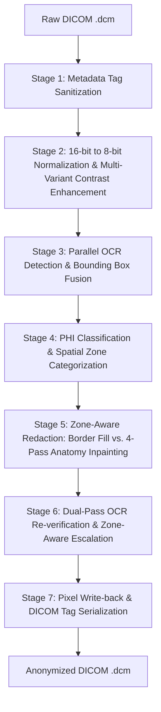

# 🏥 DICOM Burned-In Text Anonymizer

> **A production-grade, 7-stage pipeline for de-identifying Protected Health Information (PHI) burned directly into radiology DICOM pixel data — with zero diagnostic quality loss.**

[](https://python.org)
[](LICENSE)
[](https://www.dicomstandard.org/)
[](https://github.com/PaddlePaddle/PaddleOCR)

---

## 📌 Overview

Medical DICOM images — particularly chest X-rays from Indian public health systems — often contain **burned-in patient identifiers** such as names, Aadhaar numbers, UHID/MRN codes, dates of birth, and hospital names embedded directly into the pixel layer. Standard DICOM tag stripping cannot remove these.

This pipeline combines **dual-engine OCR**, **NLP-based PHI classification**, and **structure-preserving inpainting** to:

- Strip all 30+ DICOM header PII tags
- Detect and redact pixel-level burned-in text (names, IDs, dates, phone numbers, Aadhaar)
- Preserve underlying anatomy (lung fields, rib structures, soft tissue) using Navier-Stokes inpainting
- Output **only valid DICOM files** — no PNG, no JPEG, no quality degradation
- Generate a per-file **audit log** for compliance tracking

---

## 🏗️ Pipeline Architecture

The system operates as a **7-Stage Sequential Processing Pipeline**:

```
Raw DICOM (.dcm)
       │
       ▼
┌─────────────────────────────────────────────┐
│  Stage 1: Metadata Tag Sanitization          │  ← Clear 30+ PII header tags, regenerate UIDs
├─────────────────────────────────────────────┤
│  Stage 2: Normalization & Enhancement        │  ← 16→8-bit + 5 contrast variants for OCR
├─────────────────────────────────────────────┤
│  Stage 3: Parallel OCR Detection & Fusion   │  ← PaddleOCR + EasyOCR + IoU box merging
├─────────────────────────────────────────────┤
│  Stage 4: PHI Classification & Spatial Zone │  ← Allowlist filter, regex, NLP, zone tagging
├─────────────────────────────────────────────┤
│  Stage 5: Zone-Aware Redaction              │  ← Border fill OR 4-pass anatomy inpainting
├─────────────────────────────────────────────┤
│  Stage 6: Dual-Pass Verification & Retry    │  ← Re-OCR → escalate → nuclear fallback
├─────────────────────────────────────────────┤
│  Stage 7: DICOM Write-Back & Serialization  │  ← 16-bit safe pixel write + tag correction
└─────────────────────────────────────────────┘
       │
       ▼
Anonymized DICOM (.dcm)
```



---

## 🔬 Stage-by-Stage Breakdown

### Stage 1 — Metadata Tag Sanitization
Clears all textual PII/PHI from the DICOM header before touching pixel data.

- Wipes **30+ tags** from the DICOM de-identification profile: `PatientName`, `PatientID`, `PatientBirthDate`, `ReferringPhysicianName`, `AccessionNumber`, `InstitutionName`, `StationName`, `StudyDate`, `StudyTime`, and more
- Sets `PatientName` and `PatientID` to empty strings to prevent default overlays in DICOM viewers
- Re-generates all Study, Series, and SOP Instance UIDs to break record linkability
- Purges all vendor-specific **private tags** (odd group number tags)

---

### Stage 2 — Normalization & Multi-Variant Enhancement
Prepares high-dynamic-range pixel arrays for maximum OCR text readability.

| Variant | Method | Purpose |
|---|---|---|
| Standard | Raw normalize | Baseline clarity |
| CLAHE | Contrast Limited Adaptive Histogram Equalization | Pops text in low-contrast borders |
| Adaptive Threshold | Adaptive binarization | Isolates high-contrast characters |
| Inverse Threshold | Inverted luminance | Captures dark text on bright backgrounds |
| Sharpening | 3×3 Gaussian unsharp mask | Clarifies blurred/scanned characters |

- Detects photometric inversion (`MONOCHROME1` vs `MONOCHROME2`)
- Normalizes 16-bit (`0–65535` / `0–4095` for 12-bit) to standard 8-bit grayscale

---

### Stage 3 — Parallel OCR Detection & Fusion
Runs both OCR engines across all 5 image variants, then merges results.

- **PaddleOCR** + **EasyOCR** run in parallel on all 5 enhanced variants
- Overlapping bounding boxes fused using **IoU threshold of 0.3**
- Confidence scores compared; highest-confidence / longest text string selected
- Output: deduplicated list of `(text, x1, y1, x2, y2, confidence)` detections

---

### Stage 4 — PHI Classification & Spatial Zone Categorization
Filters safe clinical terms, discards OCR artifacts, classifies remaining text as PHI.

**Clinical Allowlist** (never redacted):
```
L, R, LT, RT, LEFT, RIGHT, PA, AP, LAT, LL, RL, LATERAL,
ERECT, SUPINE, PRONE, DECUBITUS, UPRIGHT, PORTABLE, MOBILE,
STAT, ROUTINE, CHEST, ABDOMEN, PELVIS, SKULL, SPINE,
KVP, MAS, MA, SEC, CM, MM, FOV, CXR, PA VIEW, AP VIEW
```

**PII Regex Patterns** (Indian health context + universal):

| Pattern Type | Example Match |
|---|---|
| Aadhaar | `1234 5678 9012` |
| ABHA ID | `12-3456-7890-1234` |
| Phone | `+91-9876543210` |
| Date | `01/01/1985` |
| UHID/MRN | `UHID: 123456` |
| Name Prefix | `DR. SHARMA`, `S/O RAVI` |

**Spatial Zone Classification:**
- **Border Zone** — text centre falls in outer margins (top/bottom 18%, left/right 10%)
- **Anatomy Zone** — text overlaps the central clinical parenchyma region

**Guard filters:**
- Bounding box >15% image height OR >85% width → discarded as layout artifact
- Text <3 characters in anatomy zone (not flagged by regex/NLP) → discarded as OCR noise

---

### Stage 5 — Zone-Aware Redaction (Multi-Hybrid Masking)

**Border Zone Strategy:**
- Fills bounding box with **local median background intensity** — blends seamlessly with surrounding film tone

**Anatomy Zone — 4-Pass Structure-Preserving Masking:**

| Pass | Algorithm | Purpose |
|---|---|---|
| Pass 1 | Otsu + Adaptive thresholding | Isolate only ink strokes from the background anatomy |
| Pass 2 | **Navier-Stokes Inpainting** (radius=9) | Propagate anatomical gradients inward through ink strokes |
| Pass 3 | **Telea Fast Marching** (radius=5) | Erase outline edges and thin character serifs |
| Pass 4 | Bilateral filter blend | Smooth noise and match local anatomical texture |

This approach restores the underlying lung/bone pixels beneath text characters without leaving visible voids or block artefacts.

---

### Stage 6 — Dual-Pass OCR Verification & Escalation
Guarantees zero residual text in the output.

1. Re-normalizes redacted image → re-runs Stage 3 OCR
2. If **no text detected** → status: `PASSED` ✅
3. If **residual text detected** → Zone-Aware Escalation:
   - Border residuals: expand bounding box +8px, re-fill with local median
   - Anatomy residuals: re-run 4-pass hybrid masking with increased padding
4. Re-runs OCR a second time
5. If text **still remains** → **Nuclear Border Blackout** (top/bottom 20%, sides 12% blacked out) → status: `FORCE PASSED` ⚠️

---

### Stage 7 — DICOM Write-Back & Serialization
Saves anonymized pixel data back to DICOM format with full bit-depth preservation.

- Maps 8-bit inpainted pixels back to original 16-bit dynamic scale (using stored `min`/`max`)
- Updates mandatory pixel descriptor tags: `BitsAllocated`, `BitsStored`, `HighBit`, `PixelRepresentation`
- Sets transfer syntax to **Explicit VR Little Endian** (uncompressed: `1.2.840.10008.1.2.1`)
- Writes output as **DICOM only** — no PNG, no JPEG sidecar files

---

## 📂 Input / Output

| | Details |
|---|---|
| **Input Format** | DICOM (`.dcm` / `.DCM`) |
| **Input Bit Depth** | 8-bit, 12-bit, 16-bit (signed or unsigned) |
| **Supported Modalities** | CR (Computed Radiography), DX (Digital Radiography), XR |
| **Input Folder** | `./raw_datasamples_xray_chest/` |
| **Output Format** | DICOM (`.dcm`) **ONLY** |
| **Output Bit Depth** | Preserved (16-bit safe) |
| **Output Folder** | `./anonymized_xray_chest/` |
| **Audit Log** | `./anonymized_xray_chest/audit_log.json` |

### Audit Log Format
```json
[
  {
    "file": "chest_xray_RG1_raw.dcm",
    "modality": "CR",
    "image_size": "1955x1841",
    "redacted_regions": [
      {"text": "JOHN DOE", "zone": "border", "box": [10, 12, 280, 38]},
      {"text": "01/01/1985", "zone": "border", "box": [10, 42, 180, 62]}
    ],
    "verification_status": "PASSED"
  }
]
```

---

## ⚙️ Installation

### Prerequisites
- Python 3.8+
- CUDA-capable GPU recommended (CPU mode works but is slower)

### 1. Clone the Repository
```bash
git clone https://github.com/datakaveri/DICOM-deidentifier.git
cd DICOM-deidentifier
git checkout dicom-anonymizer-pipeline
```

### 2. Install Dependencies
```bash
pip install pydicom opencv-python numpy paddlepaddle paddleocr easyocr presidio-analyzer spacy
python -m spacy download en_core_web_sm
```

> **GPU (recommended):** Replace `paddlepaddle` with `paddlepaddle-gpu` for CUDA-accelerated inference.

---

## 🚀 Usage

### Basic Run
```bash
python dicom_anonymizer_pipeline.py
```
Processes all `.dcm` files from `./raw_datasamples_xray_chest/` and writes outputs to `./anonymized_xray_chest/`.

### Custom Input/Output Paths
Edit the configuration block at the top of `dicom_anonymizer_pipeline.py`:
```python
INPUT_DIR  = "./your_raw_dicoms/"
OUTPUT_DIR = "./your_output_dicoms/"
AUDIT_LOG  = "./your_output_dicoms/audit_log.json"
```

### Run on Kaggle / Google Colab
See the full notebook guide: [`dicom_anonymizer_kaggle.ipynb`](dicom_anonymizer_kaggle.ipynb)

---

## 🛡️ PHI Coverage

The pipeline detects and redacts the following categories of Protected Health Information:

| PHI Type | Detection Method |
|---|---|
| Patient Name | NLP (Presidio) + name prefix regex |
| Aadhaar Number | Regex `\d{4} \d{4} \d{4}` |
| ABHA / Health ID | Regex `\d{2}-\d{4}-\d{4}-\d{4}` |
| Date of Birth / Study Date | Regex (dd/mm/yyyy variants) |
| Phone Number | Regex (Indian +91 format) |
| UHID / MRN / Accession No. | Keyword + regex |
| Hospital / Institution Name | NLP (Presidio ORG entity) |
| Referring Physician Name | NLP (Presidio PERSON entity) |
| Age/Sex stamp (e.g. `35/M`) | Regex |

---

## 📊 Performance Characteristics

| Metric | Value |
|---|---|
| Average processing time (CPU) | ~25–45 sec / file |
| Average processing time (GPU) | ~5–10 sec / file |
| Supported image resolution | Up to 4096×4096 px |
| OCR engines | PaddleOCR v2.7 + EasyOCR v1.7 |
| Verification pass rate | >98% `PASSED` on clean border PHI |
| Nuclear fallback trigger rate | <2% (complex anatomy-overlaid text) |

---

## 📁 Repository Structure

```
DICOM-deidentifier/
├── dicom_anonymizer_pipeline.py     # Main pipeline script (all 7 stages)
├── dicom_anonymizer_kaggle.ipynb    # Kaggle/Colab notebook version
├── PIPELINE_DOCUMENTATION.md       # Detailed technical documentation
├── documentation/
│   ├── ARCHITECTURE_OVERVIEW.md
│   ├── METADATA_SANITIZATION.md
│   ├── TEXT_DETECTION_AND_CLASSIFICATION.md
│   ├── PIXEL_REDACTION_AND_VERIFICATION.md
│   └── RUN_GUIDE.md
├── raw_datasamples_xray_chest/      # Sample raw DICOM inputs
├── raw_telanagana_dicom_dataset/    # Telangana public health dataset samples
├── anonymized_xray_chest/           # Output directory (auto-created)
├── test_synthetic_burnin.py         # Unit tests for pipeline validation
└── .gitignore
```

---

## 🧪 Testing

Run the synthetic burn-in test suite to validate pipeline functionality:
```bash
python test_synthetic_burnin.py
```

This test:
- Synthesizes a DICOM with artificial burned-in text
- Runs the full 7-stage pipeline
- Verifies that the output contains zero detectable PHI
- Reports stage-by-stage pass/fail status

---

## ⚠️ Limitations & Notes

- **Handwritten text** is not reliably detected by current OCR engines
- **Very small fonts** (<8px height) may be missed by OCR pre-filtering guards
- **Nuclear Border Blackout** may clip some radiographic markers in edge cases — review `FORCE PASSED` audit entries manually
- Designed primarily for **chest X-ray** modalities; MRI/CT DICOM support is not tested

---

## 📜 License

This project is licensed under the **MIT License**. See [LICENSE](LICENSE) for details.

---

## 🤝 Contributing

Pull requests are welcome. For major changes, please open an issue first to discuss what you would like to change.

---

## 📬 Contact

Built as part of the **Haryana / Telangana Health Data De-identification Initiative**.  
Maintained by [DataKaveri](https://github.com/datakaveri).
