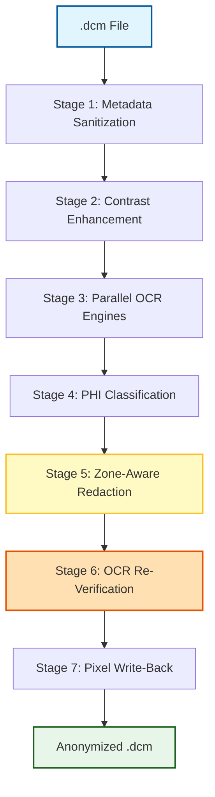

# 📐 Pipeline Architecture Overview

The **Unified DICOM Burned-In Text Anonymization Pipeline** is designed to provide clinical-grade de-identification of medical scans (modality CR/DX/XR) in compliance with HIPAA and Indian digital health standards (NDHM/ABHA).

It is structured as a **7-Stage Sequential Processing Pipeline**. Every file runs through the stages linearly, accumulating de-identification checks and redaction coordinates.

---

## 7-Stage Workflow Diagram

---

## 🏛️ Pipeline Design Constraints & Philosophy

To be safe for clinical and diagnostic use, the pipeline operates under three core rules:

### 1. DICOM-to-DICOM Format Guarantee
* **Constraint:** The pipeline must **only** produce valid DICOM (`.dcm`) output files. 
* **Reasoning:** Medical image archives (PACS) and clinical viewers cannot read JPEG or PNG files. Exporting raw scans to flat images destroys essential diagnostic and clinical header tags.

### 2. High-Dynamic Range (16-bit) Preservation
* **Constraint:** Original bit depth (e.g. 16-bit or 12-bit grayscale intensity values) must be preserved.
* **Reasoning:** Standard computer graphics use 8-bit images (256 shades of gray). Medical scans use 12-bit to 16-bit (up to 65,536 shades of gray) to capture tiny tissue density variations. The pipeline normalizes the pixel data to 8-bit *only* to perform OCR detection, but performs all redactions and final write-backs on the original 16-bit array to avoid losing clinical information.

### 3. Zero-Text-Leakage Policy
* **Constraint:** No patient text or PII should escape the pipeline.
* **Reasoning:** If single-pass OCR misses an annotation due to bad contrast, patient identity is compromised. The pipeline resolves this by using **dual-engine parallel OCR**, **multi-variant contrast enhancement passes**, and a **recursive re-verification loop** that blackouts borders if text persists (Nuclear Option).

---

## 🛠️ Technology Stack

The pipeline is built on top of standard open-source Python medical and AI frameworks:

* **`pydicom`**: Low-level DICOM header reading, metadata sanitization, and dataset serialization.
* **`OpenCV`**: Image normalization, multi-variant contrast enhancement, morphological masks, and inpainting.
* **`numpy`**: High-performance array operations for pixel dynamic scaling and multi-dimensional image arrays.
* **`PaddleOCR`**: Deep-learning OCR engine optimized for structural layouts and word text extraction.
* **`EasyOCR`**: PyTorch-based text recognizer serving as the secondary validation engine.
* **`Presidio Analyzer Engine`**: Microsoft's NLP-based entity detector used to parse sentences and identify names, phone numbers, and dates.
* **`matplotlib`**: Generates inline comparative plots inside Jupyter notebooks.
