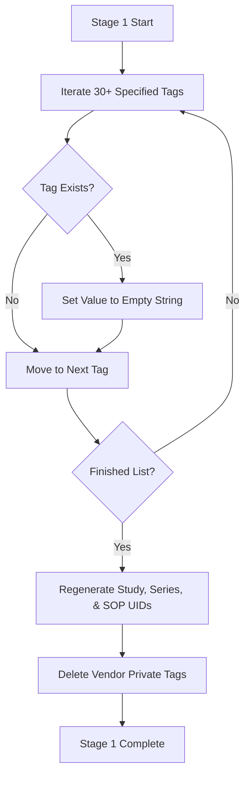

# 📋 Stage 1: Metadata Sanitization

Before processing image pixels, the pipeline cleanses the DICOM header. DICOM files store patient, hospital, and scanner information in structured header tags. Removing this data is the first line of defense in anonymization.

---

## 🔍 The De-identification Checklist

The pipeline targets **30+ metadata attributes** defined under the DICOM Standard Basic Profile for de-identification:

### 1. Patient Demographics & Contact Info
* `PatientName` — Patient's full name.
* `PatientID` — Unique medical record identifier (MRN/UHID).
* `PatientBirthDate` & `PatientBirthName` & `PatientMotherBirthName` — Date of birth and family names.
* `PatientSex` & `PatientAge` & `PatientWeight` — Age, gender, and clinical metrics.
* `PatientAddress` & `PatientTelephoneNumbers` — Phone numbers and addresses.

### 2. Clinical Contacts & Institution Info
* `ReferringPhysicianName` & `ReferringPhysicianAddress` — Doctor who ordered the scan.
* `PhysiciansOfRecord` & `PerformingPhysicianName` — Active clinical staff during scanning.
* `NameOfPhysiciansReadingStudy` & `OperatorsName` — Radiologist and technician details.
* `InstitutionName` & `InstitutionAddress` & `InstitutionalDepartmentName` — Hospital name, branch, and clinic department.

### 3. Study Details & Temporal Metrics
* `AccessionNumber` & `StudyID` & `RequestedProcedureID` — Procedure identifiers.
* `AdmittingDiagnosesDescription` & `RequestedProcedureDescription` — Pre-scan diagnostic notes.
* `StudyDate`, `SeriesDate`, `AcquisitionDate`, `ContentDate` — Scan date metrics.
* `StudyTime`, `SeriesTime`, `AcquisitionTime`, `ContentTime` — Scan timestamp metrics.

---

## 🔨 Process Flow in Stage 1

### 1. Tag Cleansing Loop
For every tag in the de-identification list, the pipeline checks if the tag exists in the DICOM dataset. If it does, it sets the value of that tag to an empty string (`""`).

### 2. UID Regeneration
If study and series identifiers remain unchanged, researchers could link anonymized images back to the hospital database.
* The pipeline checks for `StudyInstanceUID`, `SeriesInstanceUID`, and `SOPInstanceUID`.
* It calls `pydicom.uid.generate_uid()` to create globally unique, randomly generated UIDs, breaking any link back to the clinical PACS archive.

### 3. Vendor Private Tags Deletion
DICOM standards permit scanner manufacturers (Siemens, GE, Philips, etc.) to store custom diagnostic information in private tags (stored under odd-numbered groups). These tags often contain raw patient registration texts.
* The pipeline calls `ds.remove_private_tags()` to purge all vendor-specific attributes.

---

## 🚫 Why We Use Empty Strings ("") Instead of "ANONYMOUS"

Older versions of DICOM anonymizers set `PatientName` to `"ANONYMOUS"` and `PatientID` to `"ID_REDACTED"`. While safe, this creates a major usability issue in DICOM viewers (like Horos, Weasis, or Orthanc).

* **The Problem:** Many medical image viewers read `PatientName` and `PatientID` from the header and automatically paint them as text overlays in the corners of the image window. If these tags contain `"ANONYMOUS"`, the viewer renders that text over the top of the scan, obstructing the image.
* **The Solution:** The pipeline sets `PatientName = ""` and `PatientID = ""`. Because these values are blank, the viewer's text overlay remains clean and empty, ensuring clinicians can see the full scan without text block obstruction.
