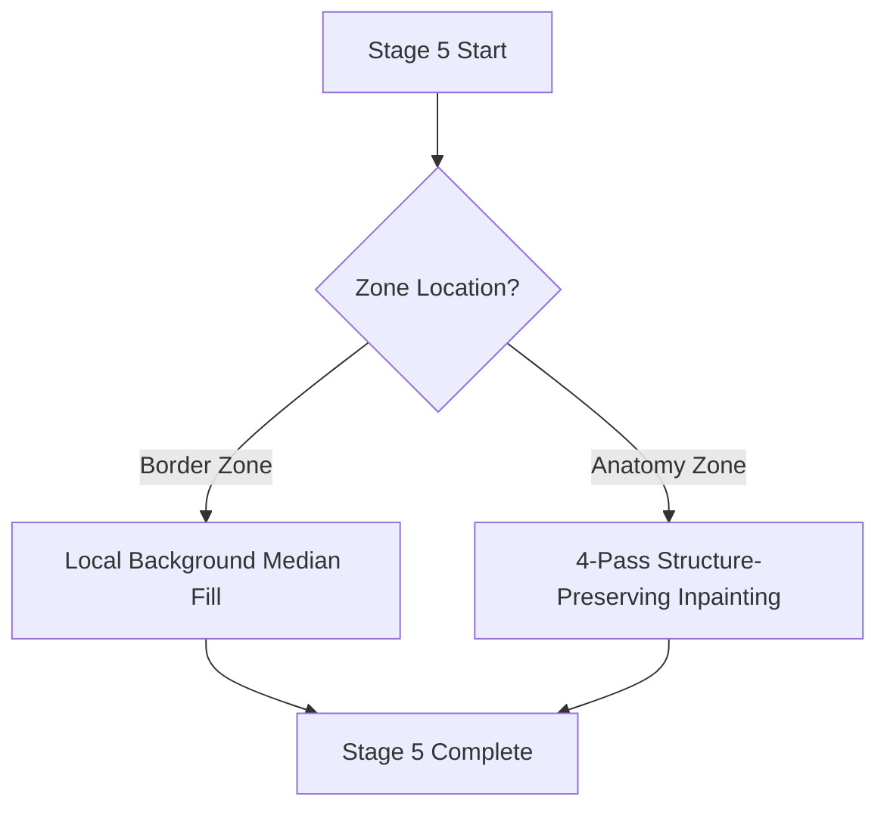
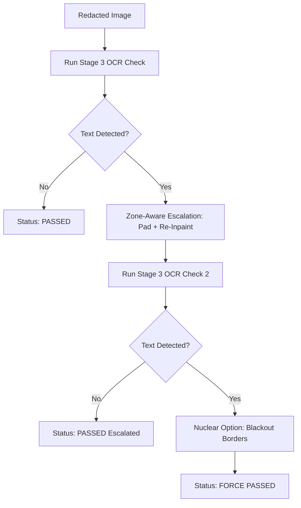

# 🖋️ Stages 5–7: Pixel Redaction & Verification

Easing or blacking out text inside the scan region is critical. If we black out a text block inside a patient's lung or bone field, we create a solid black artifact that could mimic pathology or obstruct fractures. The pipeline uses advanced zone-aware pixel inpainting to solve this.

---

## 🖋️ Stage 5: Pixel Redaction (Multi-Hybrid Masking)

The pipeline applies two different strategies depending on the text location (classified in Stage 4):

### 1. Border Zone Strategy: Local Median Fill
* **Process:** The pipeline extracts a context box expanded by 30 pixels around the text bounding box. It calculates the **median intensity value** of this context box and fills the text bounding box with it.
* **Result:** The text box is completely replaced. Because it uses the local median, it blends in with the local black/gray film borders.

### 2. Anatomy Zone Strategy: 4-Pass Inpainting
To erase text written directly over organs, ribs, or lung fields without leaving block artifacts:

* **Pass 1: Precise Ink Stroke Isolation**
  Instead of redacting the entire rectangular bounding box, the pipeline runs Otsu and Adaptive thresholding locally to isolate only the text character strokes. This creates a binary mask of just the letter outlines, leaving 90% of the underlying bone/tissue pixels untouched.
* **Pass 2: Navier-Stokes Inpainting (radius=9)**
  Using fluid-dynamics-based Navier-Stokes algorithms (`cv2.INPAINT_NS`), the pipeline propagates the surrounding anatomical gradients and textures inward along the thin ink stroke lines. This restores the bone structures and lung lines underneath the letters.
* **Pass 3: Telea Inpainting (radius=5)**
  The Fast Marching Method (`cv2.INPAINT_TELEA`) is run over any residual ink pixels missed by the Navier-Stokes pass, removing serifs and outer character outlines.
* **Pass 4: Bilateral Texture Blend**
  An edge-preserving bilateral filter is applied only to the inpainted pixels. This smooths out high-frequency noise/sharp edges from the inpainting, blending the filled strokes into the frequency of the surrounding anatomy.

---

## 🧪 Stage 6: Dual-Pass Verification & Escalation

To guarantee zero residual text, the pipeline re-runs the OCR engine on the newly anonymized image.

### 1. Verification Loop
The redacted image is normalized back to 8-bit and runs through the OCR engine. If no PHI text is found, it is saved with `Status: PASSED`.

### 2. Zone-Aware Escalation
If text is still detected, the pipeline automatically pads the coordinates (+8px) and re-runs the redaction. This handles characters that were partially clipped by the initial bounding boxes.

### 3. The Nuclear Fallback (Border Blackout)
If text still persists after the second pass (usually due to high-contrast vendor logo overlays or severe noise):
* The pipeline applies a **nuclear blackout** to the border regions (erases the top 20%, bottom 20%, and side 12% of the entire image to absolute zero/black).
* It forces the status to `FORCE PASSED (Nuclear Fallback)`.

---

## 💾 Stage 7: Pixel Write-Back & DICOM Serialization

Once verification is complete, the normalized 8-bit image must be saved back into the original 16-bit DICOM file structure.

1. **Grayscale Dynamic Re-scaling**:
   Using the stored min/max bounds from Stage 2, the pipeline scales the redacted 8-bit array back to the original 16-bit dynamic range:
   $$\text{Pixel}_{16\text{-bit}} = \frac{\text{Pixel}_{8\text{-bit}}}{255.0} \times (\text{Max} - \text{Min}) + \text{Min}$$
2. **DICOM Tag Verification**:
   The pipeline updates the mandatory pixel format tags inside the pydicom dataset:
   * `BitsAllocated` (e.g. 16)
   * `BitsStored` (e.g. 16 or 12)
   * `HighBit` (e.g. 15 or 11)
   * `PixelRepresentation` (0 for unsigned, 1 for signed)
3. **Explicit Transfer Syntax**:
   The transfer syntax is set to **Explicit VR Little Endian** (`1.2.840.10008.1.2.1`), which is the industry standard for uncompressed DICOM pixel data.
4. **File Output**:
   The raw array bytes are serialized into the `PixelData` tag, and the file is saved as a `.dcm` DICOM file.
