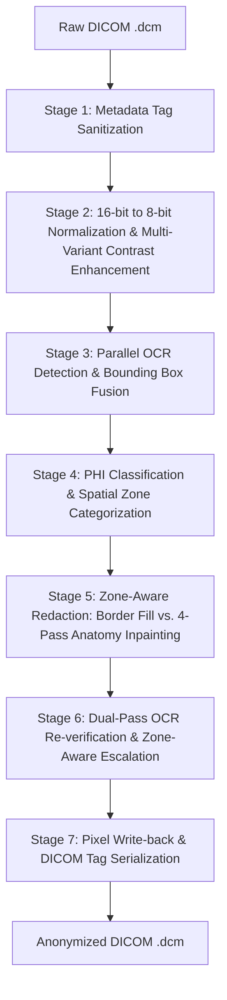

# 🏥 DICOM Burned-In Text Anonymizer Documentation Suite

Welcome to the documentation suite for the **Unified DICOM Burned-In Text Anonymization Pipeline**. This suite provides a step-by-step breakdown of how the anonymizer operates, the technical concepts behind it, and guides on how to run it in various environments (local, Google Colab, and Kaggle).

---

## 📚 Table of Contents

1. **[Architecture Overview](file:///c:/Users/Shashank/OneDrive/Desktop/haryana%20problem%20statement/documentation/ARCHITECTURE_OVERVIEW.md)**
   Understand the high-level sequential flow of the 7 pipeline stages, design philosophy, and modality/bit-depth preservation.

2. **[Stage 1: Metadata Sanitization](file:///c:/Users/Shashank/OneDrive/Desktop/haryana%20problem%20statement/documentation/METADATA_SANITIZATION.md)**
   Deep dive into DICOM header de-identification, private tag purging, UID regeneration, and the implementation of blank string overlays.

3. **[Stages 2–4: Text Detection & Classification](file:///c:/Users/Shashank/OneDrive/Desktop/haryana%20problem%20statement/documentation/TEXT_DETECTION_AND_CLASSIFICATION.md)**
   Details on image normalization, contrast enhancement variants, parallel OCR text extraction (PaddleOCR + EasyOCR), bounding box fusion (IoU), allowlist filters, size/text guards, and spatial zone categorization.

4. **[Stages 5–7: Pixel Redaction & Verification](file:///c:/Users/Shashank/OneDrive/Desktop/haryana%20problem%20statement/documentation/PIXEL_REDACTION_AND_VERIFICATION.md)**
   Explores Navier-Stokes and Telea inpainting algorithms, local background median fills, bilateral texture blending, re-OCR verification loops, zone-aware escalation, and uncompressed write-back.

5. **[Deployment & Run Guide](file:///c:/Users/Shashank/OneDrive/Desktop/haryana%20problem%20statement/documentation/RUN_GUIDE.md)**
   Step-by-step tutorials for executing the script locally or running it inside GPU-enabled Kaggle and Google Colab notebooks.

---

## 🎨 Visualizing the Pipeline

Here is the sequential flow that every DICOM file passes through:

