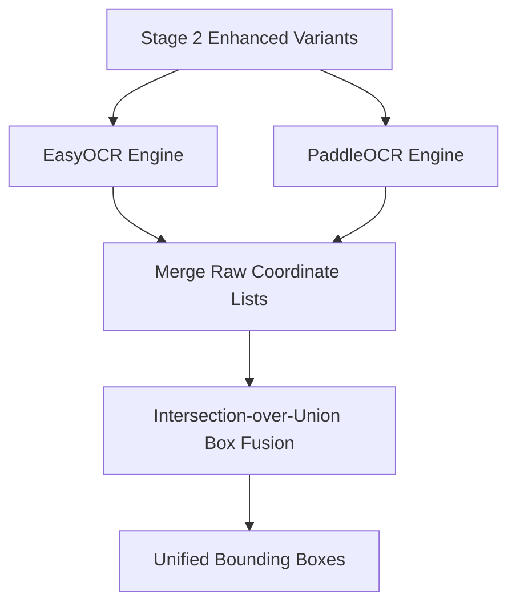

# 🌓 Stages 2–4: Text Detection & Classification

Detecting text overlaid on diagnostic radiology scans is challenging because annotations are often low-contrast, thin, or placed over dense bones and lungs. The pipeline uses image enhancement, dual OCR engines, and structured NLP rules to detect and classify PHI text.

---

## 🌓 Stage 2: Normalization & Multi-Variant Contrast Enhancement

Standard OCR engines are trained on scans of paper documents (black text on white paper). DICOM scans contain high-dynamic range grayscale pixels where text might be faint or blended with background tissues.

### 1. Dynamic Grayscale Normalization
To feed the image to OCR models, the pipeline temporarily scales the 16-bit grayscale array down to standard 8-bit space (`0 to 255`):
$$\text{Pixel}_{8\text{-bit}} = \frac{\text{Pixel}_{16\text{-bit}} - \text{Min}}{\text{Max} - \text{Min}} \times 255.0$$

### 2. Multi-Variant Contrast Enhancement
The pipeline processes the normalized image through **5 distinct filters** in parallel. This guarantees that if text is unreadable in one variant, it will stand out in another:

1. **Standard**: The original normalized 8-bit image.
2. **CLAHE (Contrast Limited Adaptive Histogram Equalization)**: Pops local details and text borders without over-amplifying noise.
3. **Adaptive Threshold**: Transforms the image into a clean binary mask to isolate text stroke shapes.
4. **Inverse Threshold**: Inverts values to help OCR engines optimized for dark characters on a light background.
5. **Sharpening**: Applies an unsharp mask filter to resolve fuzzy characters or scan lines.

---

## 🤖 Stage 3: Dual-Engine OCR & Bounding Box Fusion



### 1. Parallel OCR Engines
To prevent text leakage, the pipeline runs two engines in parallel:
* **PaddleOCR**: Highly robust with structural text blocks and scan layouts.
* **EasyOCR**: Excellent for isolated, stylized characters and alphanumeric numbers.

### 2. Bounding Box Fusion (IoU)
Both engines return a list of text strings and bounding boxes. Bounding boxes for the same word can overlap or vary by a few pixels. 
* The pipeline merges boxes using an **Intersection-over-Union (IoU) threshold of 0.3**:
$$\text{IoU} = \frac{\text{Area of Intersection}}{\text{Area of Union}}$$
* Overlapping boxes are merged into a single enclosing bounding box, and the text label with the highest confidence score is selected.

---

## 🛡️ Stage 4: PHI Classification & Guards

Not all text on a medical scan is PHI. The pipeline uses allowlists, regexes, NLP, and spatial rules to identify which boxes must be redacted.

### 1. Clinical Allowlist (Always Keep)
Radiology scans contain vital anatomical markers and scan metrics that must **never** be redacted:
* **Directional markers**: `L` (Left), `R` (Right), `LT`, `RT`.
* **Patient positioning**: `PA VIEW`, `AP`, `LAT`, `ERECT`, `SUPINE`, `PORTABLE`.
* **Anatomy/Modality**: `CHEST`, `CXR`.
* **Exposure settings**: `KVP`, `MAS`, `MA`, `SEC`.

### 2. OCR Artifact Guards
* **Size Guard**: If a bounding box spans more than 15% of image height, 85% of image width, or 10% of total image area, it is identified as a layout artifact (e.g. collimator borders) and ignored.
* **Short-Text Guard**: Single or double characters (e.g. `'1'`, `'x'`, `'A'`) inside the clinical region are ignored to prevent redacting anatomical features unless they trigger a regex/NLP check.

### 3. Spatial Zone Classification
The pipeline classifies the location of each text box:
* **Border Zone**: Outside margin (top/bottom 18%, left/right 10%). Standard clinical text overlays are placed here.
* **Anatomy Zone**: Central clinical field (where lungs, heart, or bones reside).

```
+------------------------------------------+
|               BORDER ZONE                |
|  [Name, Hospital, DOB]                   |
+----+--------------------------------+----+
| B  |                                | B  |
| O  |                                | O  |
| R  |          ANATOMY ZONE          | R  |
| D  |       (Scan Area)              | D  |
| E  |                                | E  |
| R  |                                | R  |
+----+--------------------------------+----+
|               BORDER ZONE                |
+------------------------------------------+
```

### 4. Classification Decision Logic
* **If in Border Zone**: Redacted if it matches regex PII, NLP PII, or simply resides in the border (aggressive safe default).
* **If in Anatomy Zone**: Redacted *only* if it matches a regex pattern, an NLP check, or unknown non-allowlist text (to prevent destroying clinical features).
